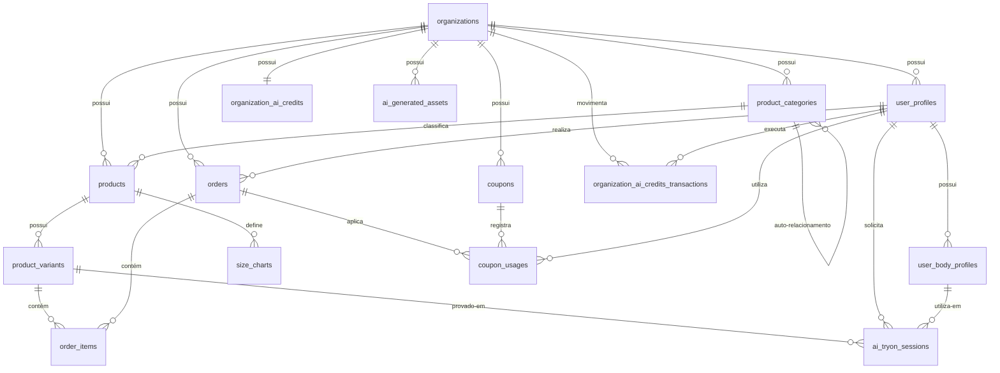

# Documentação de Modelagem de Dados — Fashion Mall IA (Revisada)

Esta documentação descreve o design lógico do banco de dados relacional revisado para o **Fashion Mall IA**.

---

## 1. Diagrama Lógico de Dados (Mermaid)

---

## 2. Dicionário de Dados e Estruturas de Tabelas

### 2.1. Clientes / Usuários (`user_profiles`)
Representa o perfil básico de acesso de clientes e administradores da loja virtual.

| Campo | Tipo | Restrições | Descrição |
| :--- | :--- | :--- | :--- |
| `id` | `uuid` | PK, FK | Chave primária. Referencia `auth.users.id`. |
| `email` | `text` | Unique | E-mail de cadastro. |
| `full_name` | `text` | Not Null | Nome completo do usuário. |
| `whatsapp` | `text` | Nullable | Número de WhatsApp. |
| `cpf` | `text` | Nullable, Unique | Cadastro de Pessoa Física. |
| `cnpj` | `text` | Nullable | Cadastro de Pessoa Jurídica (opcional). |
| `role` | `text` | Not Null | Perfil de permissão (`client`, `admin`). |
| `organization_id` | `uuid` | FK | Vinculado à organização/loja (`organizations.id`). |
| `status` | `text` | Default 'active' | Estado da conta (`active`, `suspended`). |
| `created_at` | `timestamptz`| Default now() | Data de criação do registro. |
| `updated_at` | `timestamptz`| Default now() | Data da última atualização. |

---

### 2.2. Categorias de Produtos (`product_categories`)
Estrutura hierárquica recursiva para permitir múltiplos níveis de subcategorias.

| Campo | Tipo | Restrições | Descrição |
| :--- | :--- | :--- | :--- |
| `id` | `bigint` | PK | Chave primária auto-incremental. |
| `organization_id` | `uuid` | FK, Not Null | Referência a `organizations.id`. |
| `name` | `text` | Not Null | Nome da categoria (ex: "Calças", "Vestidos"). |
| `parent_id` | `bigint` | FK, Nullable | Referência recursiva a `product_categories.id` para subcategorias. |
| `created_at` | `timestamptz`| Default now() | Data de criação. |

---

### 2.3. Produtos (`products`)
Tabela principal contendo as informações macro/comuns do produto.

| Campo | Tipo | Restrições | Descrição |
| :--- | :--- | :--- | :--- |
| `id` | `uuid` | PK | Chave primária. |
| `organization_id` | `uuid` | FK, Not Null | Referência a `organizations.id`. |
| `category_id` | `bigint` | FK | Categoria do produto (`product_categories.id`). |
| `name` | `text` | Not Null | Nome comercial do produto. |
| `description` | `text` | Nullable | Descrição detalhada do produto. |
| `base_price` | `numeric(10,2)`| Not Null | Preço base de venda do produto. |
| `image_url` | `text` | Nullable | URLs das imagens principais separadas por vírgula. |
| `is_active` | `boolean` | Default true | Define se o produto está visível na loja. |
| `weight` | `numeric(6,3)` | Nullable | Peso físico do produto em Kg (para cálculo de frete). |
| `width` | `integer` | Nullable | Largura da embalagem em cm. |
| `height` | `integer` | Nullable | Altura da embalagem em cm. |
| `length` | `integer` | Nullable | Comprimento da embalagem em cm. |
| `created_at` | `timestamptz`| Default now() | Data de cadastro. |
| `updated_at` | `timestamptz`| Default now() | Última edição do cadastro. |

---

### 2.4. Variantes de Produtos (`product_variants`)
Novidade: Tabela de grade para variação de SKU física (Tamanho e Cor).

| Campo | Tipo | Restrições | Descrição |
| :--- | :--- | :--- | :--- |
| `id` | `uuid` | PK | Chave primária da variante. |
| `product_id` | `uuid` | FK, Not Null | Referência ao produto pai (`products.id`). |
| `sku` | `text` | Unique, Nullable | SKU específico do estoque (Stock Keeping Unit). |
| `size` | `text` | Not Null | Tamanho específico (ex: "P", "M", "42"). |
| `color` | `text` | Not Null | Cor específica (ex: "Preto", "Azul"). |
| `additional_price` | `numeric(10,2)`| Default 0.00 | Preço adicional somado ao `base_price` do produto (se houver). |
| `stock_quantity` | `integer` | Default 0 | Saldo físico disponível em estoque para esta grade. |
| `variant_image_url`| `text` | Nullable | Imagem específica desta cor/tamanho (substitui a principal). |
| `is_active` | `boolean` | Default true | Define se a grade está disponível. |
| `created_at` | `timestamptz`| Default now() | Data de cadastro da grade. |
| `updated_at` | `timestamptz`| Default now() | Última edição. |

---

### 2.5. Pedidos (`orders`)
Guarda o cabeçalho das compras finalizadas e seu status de pagamento e envio.

| Campo | Tipo | Restrições | Descrição |
| :--- | :--- | :--- | :--- |
| `id` | `text` | PK | ID do pedido (ex: `ORD-1718394829-9941`). |
| `organization_id` | `uuid` | FK, Not Null | Referência a `organizations.id`. |
| `user_id` | `uuid` | FK, Nullable | Comprador logado (`user_profiles.id`). |
| `customer_name` | `text` | Not Null | Nome do comprador no checkout. |
| `customer_email` | `text` | Not Null | E-mail de contato do comprador. |
| `customer_phone` | `text` | Not Null | Telefone/WhatsApp do comprador. |
| `customer_cpf` | `text` | Not Null | CPF do comprador. |
| `shipping_address` | `text` | Not Null | Endereço completo formatado para entrega. |
| `shipping_cost` | `numeric(10,2)`| Not Null | Custo do frete. |
| `shipping_method` | `text` | Not Null | Transportadora/Serviço. |
| `total_amount` | `numeric(10,2)`| Not Null | Valor total líquido a pagar. |
| `payment_method` | `text` | Not Null | Método selecionado (`Pix`, `Cartão de Crédito`). |
| `payment_id` | `text` | Nullable | ID da transação no intermediador (Mercado Pago). |
| `payment_status` | `text` | Default 'pending' | Status interno do pagamento (`pending`, `paid`). |
| `status` | `text` | Default 'Pendente' | Status logístico (`Pendente`, `Preparando`, `Enviado`, `Entregue`). |
| `tracking_code` | `text` | Nullable | Código de rastreamento do frete. |
| `created_at` | `timestamptz`| Default now() | Data de emissão. |
| `updated_at` | `timestamptz`| Default now() | Data de atualização. |

---

### 2.6. Itens do Pedido (`order_items`)
Relacionamento N:N detalhando os produtos e a grade de variantes comprada.

| Campo | Tipo | Restrições | Descrição |
| :--- | :--- | :--- | :--- |
| `id` | `uuid` | PK | Chave primária. |
| `organization_id` | `uuid` | FK, Not Null | Referência a `organizations.id`. |
| `order_id` | `text` | FK, Not Null | Referência a `orders.id`. |
| `variant_id` | `uuid` | FK, Not Null | Referência à grade específica comprada (`product_variants.id`). |
| `product_name` | `text` | Not Null | Nome do produto (histórico). |
| `size_color_label` | `text` | Not Null | Descrição da grade comprada (ex: "Cor: Azul | Tam: M"). |
| `quantity` | `integer` | Not Null | Quantidade comprada do item. |
| `unit_price` | `numeric(10,2)`| Not Null | Preço unitário praticado na compra. |
| `created_at` | `timestamptz`| Default now() | Data do registro. |

---

### 2.7. Cupons de Desconto (`coupons`)
Tabela para gerenciar regras de cupons promocionais.

| Campo | Tipo | Restrições | Descrição |
| :--- | :--- | :--- | :--- |
| `id` | `uuid` | PK | Chave primária. |
| `organization_id` | `uuid` | FK, Not Null | Referência a `organizations.id`. |
| `code` | `text` | Not Null | Código do cupom em caixa alta (ex: `FASHION10`). |
| `discount_type` | `text` | Not Null | Tipo do desconto (`percentage`, `fixed_value`). |
| `discount_value` | `numeric(10,2)`| Not Null | Valor do desconto. |
| `min_order_value` | `numeric(10,2)`| Default 0.00 | Valor mínimo do pedido para ativação. |
| `max_discount_value`| `numeric(10,2)`| Nullable | Teto máximo de desconto (para cupom percentual). |
| `usage_limit` | `integer` | Nullable | Quantidade máxima total de usos. |
| `used_count` | `integer` | Default 0 | Contador de vezes que já foi utilizado. |
| `start_date` | `timestamptz`| Nullable | Data/Hora de início. |
| `end_date` | `timestamptz`| Nullable | Data/Hora de expiração. |
| `is_active` | `boolean` | Default true | Estado do cupom. |
| `created_at` | `timestamptz`| Default now() | Data de cadastro. |

---

### 2.8. Histórico de Uso de Cupons (`coupon_usages`)
Rastreabilidade de cupons aplicados a pedidos específicos.

| Campo | Tipo | Restrições | Descrição |
| :--- | :--- | :--- | :--- |
| `id` | `uuid` | PK | Chave primária. |
| `coupon_id` | `uuid` | FK, Not Null | Referência a `coupons.id`. |
| `order_id` | `text` | FK, Not Null | Referência a `orders.id`. |
| `user_id` | `uuid` | FK, Not Null | Usuário beneficiado (`user_profiles.id`). |
| `discount_applied` | `numeric(10,2)`| Not Null | Valor monetário de desconto efetivamente aplicado. |
| `created_at` | `timestamptz`| Default now() | Data do uso. |

---

### 2.9. Créditos IA da Loja (`organization_ai_credits`)
Novidade: Carteira de créditos no nível da **organização/loja** (Plano Assinado), e não do consumidor final.

| Campo | Tipo | Restrições | Descrição |
| :--- | :--- | :--- | :--- |
| `organization_id` | `uuid` | PK, FK | Referência à loja proprietária (`organizations.id`). |
| `available_credits` | `integer` | Default 0 | Créditos restantes do saldo contratado da loja. |
| `created_at` | `timestamptz`| Default now() | Data de criação. |
| `updated_at` | `timestamptz`| Default now() | Data do último saldo modificado. |

---

### 2.10. Histórico de Transações de Créditos IA da Loja (`organization_ai_credits_transactions`)
Extrato detalhado de gastos de créditos efetuados pela loja.

| Campo | Tipo | Restrições | Descrição |
| :--- | :--- | :--- | :--- |
| `id` | `uuid` | PK | Chave primária. |
| `organization_id` | `uuid` | FK, Not Null | Loja afetada (`organizations.id`). |
| `user_id` | `uuid` | FK, Not Null | Usuário que gerou o consumo (cliente que usou provador) ou recarga (`user_profiles.id`). |
| `amount` | `integer` | Not Null | Quantidade de créditos movimentados. |
| `transaction_type` | `text` | Not Null | Tipo (`purchase`, `usage_tryon`, `usage_size_rec`, `bonus`). |
| `description` | `text` | Nullable | Detalhe textual da geração (ex: "Provador IA usado no produto X"). |
| `created_at` | `timestamptz`| Default now() | Data da operação. |

---

### 2.11. Perfis Corporais do Usuário (`user_body_profiles`)
Novidade: Permite que um mesmo usuário cadastre múltiplos perfis (ex: "Meu Perfil", "Namorado(a)", "Filho").

| Campo | Tipo | Restrições | Descrição |
| :--- | :--- | :--- | :--- |
| `id` | `uuid` | PK | Chave primária. |
| `user_id` | `uuid` | FK, Not Null | Referência ao usuário proprietário (`user_profiles.id`). |
| `profile_name` | `text` | Not Null | Nome amigável do perfil (ex: "Meu Corpo", "Esposa"). |
| `is_default` | `boolean` | Default false | Define o perfil ativo padrão para busca e recomendação. |
| `gender` | `text` | Nullable | Gênero para base de moldes (`male`, `female`, `unisex`). |
| `height_cm` | `numeric(5,2)` | Not Null | Altura em centímetros. |
| `weight_kg` | `numeric(5,2)` | Not Null | Peso em quilogramas. |
| `chest_cm` | `numeric(5,2)` | Nullable | Busto/Tórax em cm. |
| `waist_cm` | `numeric(5,2)` | Nullable | Cintura em cm. |
| `hips_cm` | `numeric(5,2)` | Nullable | Quadril em cm. |
| `shoulder_cm` | `numeric(5,2)` | Nullable | Ombro a ombro em cm. |
| `body_shape` | `text` | Nullable | Formato corporal (ex: `oval`, `ampulheta`, `retangulo`). |
| `created_at` | `timestamptz`| Default now() | Data de registro. |
| `updated_at` | `timestamptz`| Default now() | Última edição. |

---

### 2.12. Tabela de Medidas das Roupas (`size_charts`)
Dimensões de fábrica para recomendação inteligente de tamanho.

| Campo | Tipo | Restrições | Descrição |
| :--- | :--- | :--- | :--- |
| `id` | `uuid` | PK | Chave primária. |
| `product_id` | `uuid` | FK, Nullable | Produto associado (`products.id`). |
| `category_id` | `bigint` | FK, Nullable | Categoria de fallback (`product_categories.id`). |
| `size_label` | `text` | Not Null | Grade de tamanho (ex: `P`, `M`, `G`). |
| `min_chest_cm` | `numeric(5,2)` | Nullable | Busto/Tórax mínimo. |
| `max_chest_cm` | `numeric(5,2)` | Nullable | Busto/Tórax máximo. |
| `min_waist_cm` | `numeric(5,2)` | Nullable | Cintura mínima. |
| `max_waist_cm` | `numeric(5,2)` | Nullable | Cintura máxima. |
| `min_hips_cm` | `numeric(5,2)` | Nullable | Quadril mínimo. |
| `max_hips_cm` | `numeric(5,2)` | Nullable | Quadril máximo. |
| `created_at` | `timestamptz`| Default now() | Data de cadastro. |

---

### 2.13. Cache e Otimização de Imagens de IA (`ai_generated_assets`)
Novidade: Tabela para gerenciar cache de imagens profissionais, provadores e assets gerados por IA, impedindo cobranças e processamentos redundantes na API de IA.

| Campo | Tipo | Restrições | Descrição |
| :--- | :--- | :--- | :--- |
| `id` | `uuid` | PK | Chave primária. |
| `organization_id` | `uuid` | FK, Not Null | Loja proprietária do asset (`organizations.id`). |
| `asset_type` | `text` | Not Null | Tipo do asset (`banner`, `professional_photo`, `virtual_model`, `tryon`). |
| `prompt_hash` | `text` | Unique, Not Null | Hash (SHA-256) dos parâmetros e fotos de entrada. Usado para busca rápida antes de solicitar novas gerações. |
| `input_parameters` | `jsonb` | Not Null | Dicionário contendo os parâmetros de entrada (ex: URLs de fotos corporais, vestuários, etc.). |
| `generated_url` | `text` | Nullable | Link do asset final armazenado no bucket Supabase. |
| `status` | `text` | Default 'pending' | Estado do processamento (`pending`, `completed`, `failed`). |
| `error_message` | `text` | Nullable | Armazena detalhes em caso de falha de geração pela IA. |
| `created_at` | `timestamptz`| Default now() | Data de criação. |

---

### 2.14. Fila e Histórico de Sessões do Provador IA (`ai_tryon_sessions`)
Mantém o rastreamento das sessões de provador geradas para a interface do cliente final.

| Campo | Tipo | Restrições | Descrição |
| :--- | :--- | :--- | :--- |
| `id` | `uuid` | PK | Chave primária. |
| `user_id` | `uuid` | FK, Not Null | Usuário solicitante (`user_profiles.id`). |
| `variant_id` | `uuid` | FK, Not Null | Grade do produto que está provando (`product_variants.id`). |
| `body_profile_id` | `uuid` | FK, Not Null | Medidas corporais utilizadas (`user_body_profiles.id`). |
| `asset_id` | `uuid` | FK, Nullable | Link para o cache do asset gerado (`ai_generated_assets.id`). |
| `status` | `text` | Default 'pending' | Status (`pending`, `processing`, `completed`, `failed`). |
| `created_at` | `timestamptz`| Default now() | Data de início. |
| `updated_at` | `timestamptz`| Default now() | Data de atualização. |
